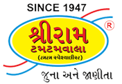

# Shri Ram Tamtamwala - Heritage Brand Portal



A premium digital experience honoring the 79-year culinary legacy of **Shri Ram Tamtamwala**, Vadodara's iconic landmark since 1947. Designed with a "Quiet Luxury" aesthetic, this portal blends tradition with modern high-fidelity web standards.

## 🏛️ The Legacy
Established in 1947 by the Chokhandi main branch, Shri Ram Tamtamwala has been the custodian of authentic Vadodara flavors for nearly eight decades. This website serves as a digital bridge between that rich heritage and a global audience.

## ✨ Key Features

- **Quiet Luxury Design**: A minimalist, high-end aesthetic featuring glassmorphism, refined typography, and a harmonious "Ivory, Charcoal & Gold" color palette.
- **Dynamic Heritage Counter**: Automated year-counting logic that accurately calculates the brand's legacy from 1947 in real-time.
- **High-Fidelity Responsiveness**: Optimized for every device, from ultra-small mobile screens (334px) to expansive 4K desktop displays.
- **Boutique User Interface**:
  - **Heritage Atelier Contact**: A sophisticated inquiry system designed with a premium stationary aesthetic.
  - **Interactive Bento Menu**: A modern, filtered menu system for exploring the full range of Farsan and snacks.
  - **Cinematic Hero Sections**: Immersive, full-height visuals that tell the story of tradition.
- **Performance Optimized**: 
  - 100% Local Asset Integrity (No external image dependencies).
  - Modern CSS3 animations and transitions.
  - Lightweight JavaScript for smooth scroll reveals and interactivity.

## 🛠️ Technical Stack

- **Structure**: Semantic HTML5
- **Styling**: Vanilla CSS3 (Custom Design System) & Bootstrap 5.3.3 (CDN)
- **Logic**: Vanilla JavaScript (ES6+)
- **Typography**: Google Fonts (Outfit & Playfair Display)
- **Assets**: Locally hosted high-resolution heritage imagery.

## 📁 Project Structure

```text
├── index.html          # The Grand Entrance (Home)
├── about.html          # The 79-Year Story
├── menu.html           # Full Interactive Menu
├── farsan.html         # Signature Collections
├── gallery.html        # Visual Archives
├── manufacturing.html  # Craftsmanship & Process
├── press.html          # Media & Recognitions
├── contact.html        # Concierge & Inquiries
├── styles.css          # Unified Design System
├── main.js             # Interaction & Dynamic Logic
└── Images/             # Local Asset Vault
```

## 🚀 Local Development

To view the project locally:

1. Clone the repository.
2. Navigate to the project root.
3. Start a local server:
   ```bash
   npx serve .
   ```
4. Open your browser at `http://localhost:3000`.

---

© 1947–2026 Shri Ram Tamtamwala. Crafted for a Heritage of Taste.
